# The 24 Best Home Furniture Stores in 2025 (Full Review)

 This list shows the best online stores for home decor and furniture that have a wide range of styles, clear prices, and reliable shipping. You can find the right home furniture quickly without paying too much for style or having trouble with delivery times.
 Expect easier browsing, better availability, and more coverage room by room—from sofas and beds to rugs and patios—so you can outfit every room with more control over your budget and schedule.

 These choices strike a balance between variety and quality signals like well-known brands, curated collections, and useful services that make setting up easier and less stressful at home.
 These platforms have all the styles you see on social media and in showrooms, so you don't have to go to a dozen different sites to find them.

 ## [Wayfair](<https://www.wayfair.com>)
 A huge online home store that has almost everything and is easy to sort through. Most items ship for free most of the time.
 - A large selection of furniture, decor, and outdoor items that can be filtered by style and price quickly.
 - You can easily look through living rooms, bedrooms, dining rooms, and more, and they will deliver large items.
 - Great for setting up your whole home when you want everything in one cart and know when it will arrive.

 ## [IKEA](<https://www.ikea.com/us/en/>
 Furniture that is modern, affordable, and easy to pick up and deliver. This makes it easier to work on projects in small spaces and in your first home.

 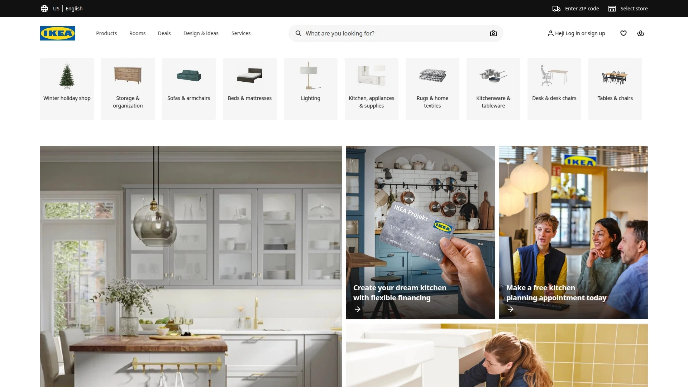

 - Shop online or in person with Click & Collect and cheap delivery starting at clear price points.
 - A wide range of products and room guides for living rooms, bedrooms, storage, and workspaces.
 - Save even more by using As-Is Online to reserve gently used items ahead of time.

 [Amazon Home](<https://www.amazon.com>)
 A huge marketplace layer for affordable furniture and decor, with lots of styles, fast shipping, and lots of real-life buyer photos to help you make decisions.

 

 - A wide range of items, with curated lists that help you find surprisingly stylish and cheap items.
 - Creator rundowns and video guides that are helpful for getting ideas for rooms quickly.

 [Walmart](<https://www.walmart.com/cp/furniture/103150>)
 Affordable furniture staples with frequent sales, quick shipping, and lots of ways to make small spaces work in living rooms, bedrooms, and home offices.
 - Clear delivery times on product pages and easy navigation between categories for core essentials.
 - Entry-level sofas, TV stands, storage, and desks are great deals for quick wins.

 ## [Target](<https://www.target.com/c/furniture/-/N-5xtnr>)
 Trendy furniture and decor with lines that work well together, easy shipping and pickup, and regular storewide sales to help you update your rooms quickly.

 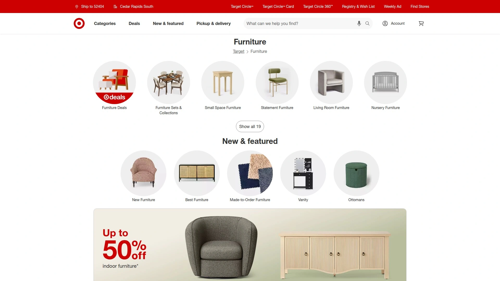

 - Shopping flow by room, from living room anchors to accent pieces and storage.
 - Discounts that last all year and seasonal events that help you get more for your money on trendy designs.

 The Home Depot
 A good place to buy furniture and outdoor sets with easy shipping. They also have a wide range of patio, utility, and mixed-material living pieces.

 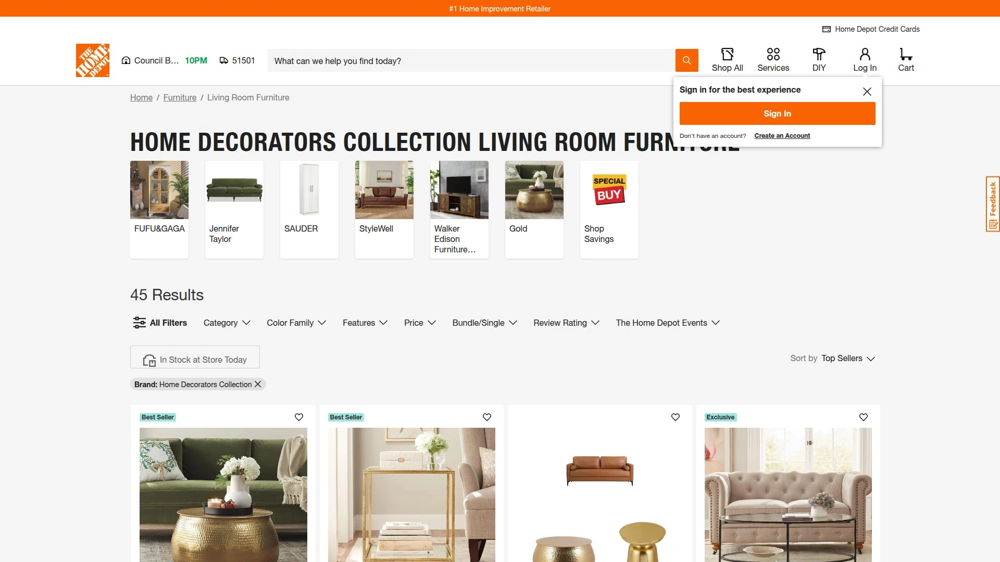

 - A wide range of options for the living room, dining room, and patio, all made from strong materials that can handle a lot of use.
 - Easy online ordering, flexible delivery, and the option to pick up in-store.

 Bed Bath & Beyond
 A comeback catalog with a mix of furniture, bedding, and bath items, now with easier online browsing and regular category deals.

 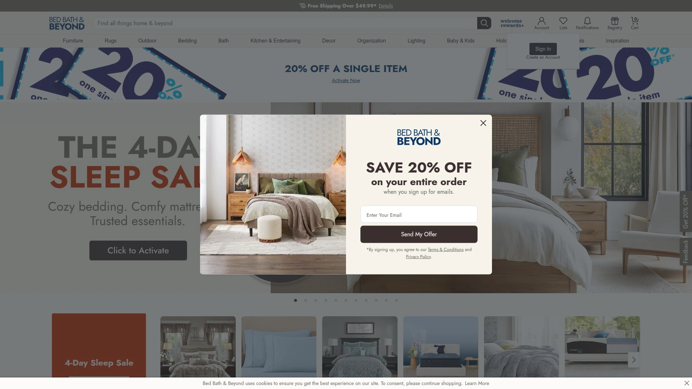

 - Good coverage for furniture in the living room, bedroom, and bathroom, as well as everyday home items.
 - A more streamlined online experience than in the past, with a focus on useful home improvements.

 ## [Crate & Barrel](<https://www.crateandbarrel.com>)
 Modern designs that use smart materials and make the most of space are good for anyone who wants to live and eat in a way that lasts.

 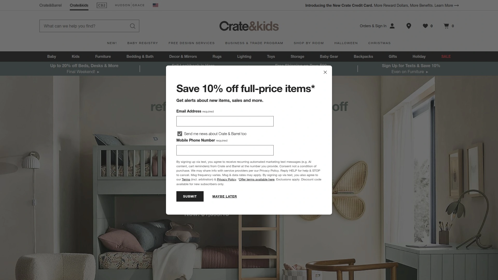

 - Carefully chosen furniture, dining, storage, and accents for the living room that all go together.
 - Store services and delivery options make it easier to buy more and change the look of a whole room.

 ## [West Elm](<https://www.westelm.com>)
 Modern furniture with a clean look, carefully chosen fabrics, and room collections that make it easy to create a cohesive look.

 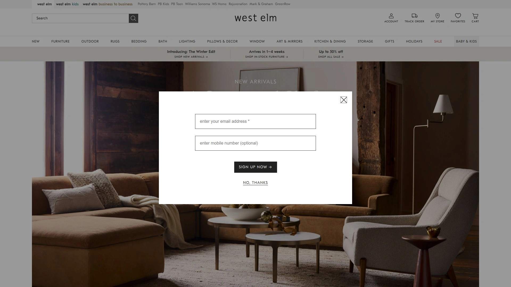

 - Focus on modern shapes, carefully chosen colors, and coordinating the whole room.
 - Part of a bigger retail family with stores and an online store for more access and help.

 Pottery Barn
 American style that lasts, with strong centerpieces and collections that match for the living room, dining room, and bedroom.

 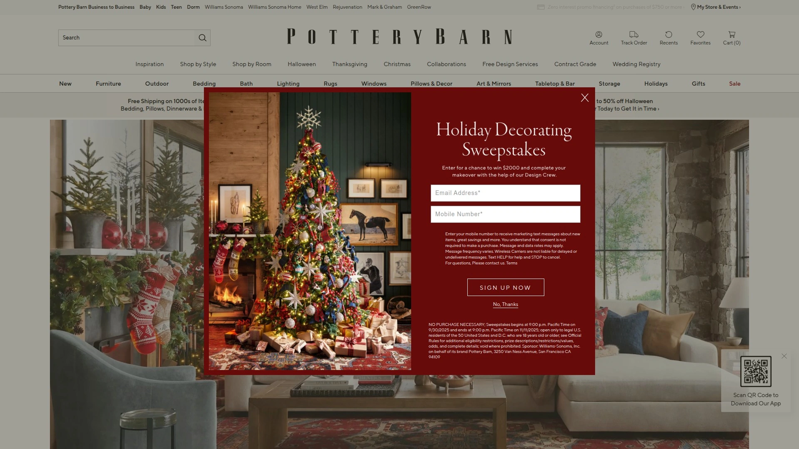

 - Full coverage of the home, from sofas and beds to storage and lighting, with a consistent style.
 - More options for kids and teens when planning family setups with more than one room.

 ## [CB2](<https://www.cb2.com>)
 Modern furniture and decor with bold collaborations and sleek shapes that make a statement in any room.

 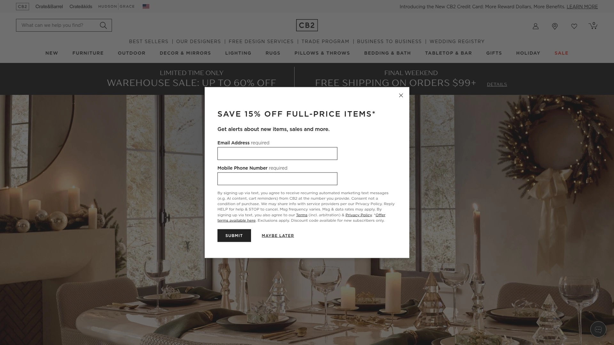

 - Unique designer collaborations offer one-of-a-kind items at reasonable prices for the look. - Design services and flexible shipping options make it easier to buy more.

 Anthropologie Home (https://www.anthropologie.com/anthrohome/collection-furniture)
 Furniture that is eclectic and on-trend, with artisan touches and pieces that focus on texture to make rooms stand out and add depth to your style.
 - Displays and design in the store, as well as custom options and swatches, help you choose with confidence.
 - New furniture drops keep the catalog fresh and interesting.

 Urban Outfitters Home
 A youthful home range for apartments and small spaces that includes fun materials, small furniture, and expressive decor.
 - Great choices for dorms, studios, and first apartments in both furniture and bedding. - Part of a larger retail family that offers lifestyle categories next to each other for one-stop shopping.

 ## [AllModern](<https://www.allmodern.com>)
 Wayfair's modern-first furniture brand, which focuses on clean lines, quick shipping options, and trendy must-haves.
 - A modern selection that makes it easy to choose sofas, tables, and lighting that all go together.
 - Having a physical presence in addition to online shopping can make you feel more confident.

 ## [Joss & Main](<https://www.jossandmain.com>)
 Furniture and decor that are stylish and focus on value and freshness. These are great for quick room updates or accent swaps.
 - A selection of trendy items for the living room, dining room, and bedroom at reasonable prices.
 - A member of the Wayfair family, which means more options and reliable delivery.

 ## [Birch Lane](<https://www.birchlane.com>)
 A carefully chosen catalog of traditional-style furniture and decor for homes that will last.
 - A more focused selection than bigger marketplaces, making it easier to choose classic styles.
 - More stores make it easier to find things and check their fit when you order online.

 ## [Perigold](<https://www.perigold.com>)
 Wayfair is a luxury-focused furniture marketplace that sells designer brands and offers high-end services for high-end projects.
 - A wide range of high-end items and personalized service for difficult rooms.
 - Physical stores going online to help people touch and feel high-end pieces.

 ## [Ruggable](<https://ruggable.com>)
 Rugs that can be washed in a machine and have a two-part system that makes cleaning up easy in homes with kids or pets.

 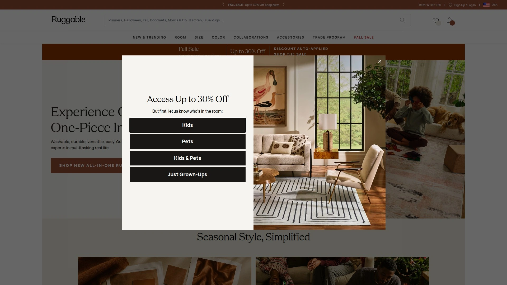

 - The smart design of the cover and pad makes it easier to clean and makes the rug last longer in areas with a lot of foot traffic.
 - Fits well in kitchens and living rooms where spills happen a lot.

 ## [Rugs USA](<https://www.rugsusa.com>)
 A wide range of styles and sizes, with frequent sales on them, makes it easy and cheap to quickly layer rooms.

 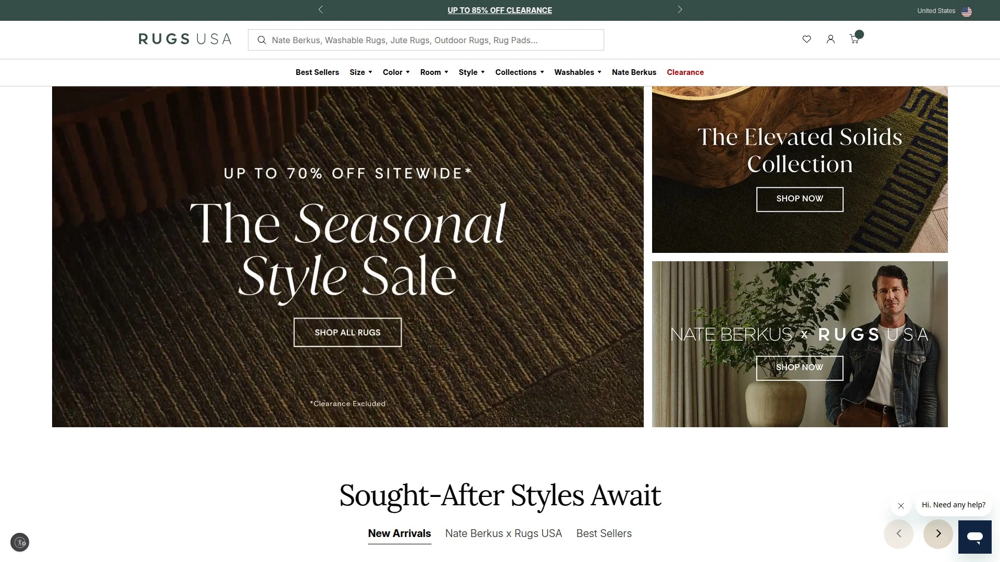

 - A wide range of styles and price points, from modern to traditional to shag.
 - Available at many major stores for easy access and returns.

 ## [Rugs.com](<https://rugs.com>)
 A huge selection of rugs, with quick, free shipping and easy returns. This is helpful for getting the exact colors and sizes you want.

 ![Screenshot of Rugs.com] (image/rugs.webp)

 - More than 100,000 choices and free returns within 30 days to lower the risk of color and texture.
 - Help is available 24/7 for quick questions about planning a room and checking out.

 ## [Pottery Barn Teen](<https://www.pbteen.com>)
 Teen-friendly furniture and decor that looks good, works well, and can be changed as needs change for small study spaces.

 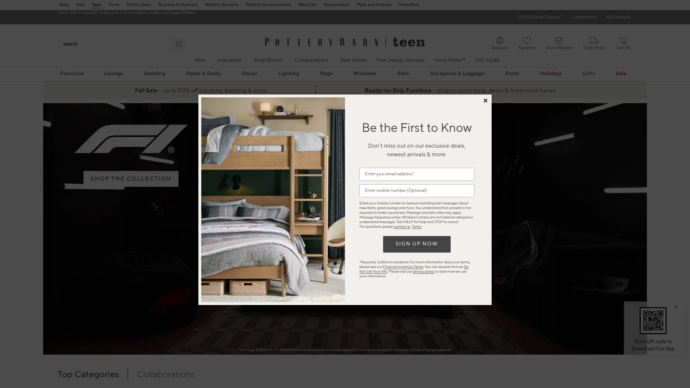

 - Bedding, desks, seating, and storage made just for teen rooms. - Fits in with the rest of the family's style for a cohesive look around the house.

 ## [Pottery Barn Kids](<https://www.potterybarnkids.com>)
 Furniture for nurseries and kids' rooms that is safe, comfortable, and looks good together for more than one growth stage.

 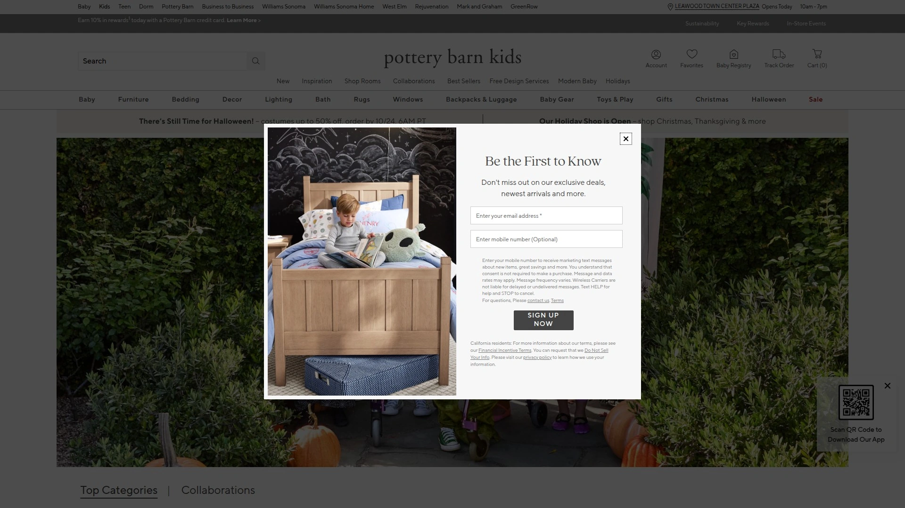

 - Cribs, beds, storage, and textiles that are made to be used every day and are easy to clean.
 - Complements adult collections to create a whole-home design language.

 ## [Crate & Kids](<https://www.crateandbarrel.com/kids/>)
 Furniture and decor for kids that is stylish, has registry support, and is easy to use for first-time setups.

 

 - Planning is easier and faster with design services available in-store and online.
 - Use a mix of fun decorations and sturdy furniture to make rooms that last and are safe for kids.

 [Home Decorators Collection](<https://www.homedepot.com/b/Furniture-Living-Room-Furniture/Home-Decorators-Collection/N-5yc1vZc7p3Z4vr>)
 The Home Depot has a reliable in-house line of living room essentials that are always available and have clear delivery paths.

 ![Screenshot of Home Decorators Collection] (image/homedepot.webp)

 - Sofas, chairs, and storage with simple specs and materials that are easy to find. - Easy to add to other home projects for one-stop shopping.

 - How do I quickly set up a whole living room online?
 Choose a store that has a wide range of items in stock and can deliver large items safely. Then, narrow your choices by room and style.

 - What is the quickest way to look at sofas at different price points?
 Start with a big store or marketplace that sells many brands. Then, narrow your search by size and fabric, and read reviews and shipping times.

 - Where can I find outdoor furniture that will last without spending too much?
 Pick stores that have collections for patios and materials that can handle the weather. Before you check out, make sure to check the store's shipping and return policies.

 ### The End
 These stores offer a good mix of styles, delivery options, and choices so you can upgrade your home furniture more quickly and easily.
 If you're starting from scratch, Wayfair is the best choice for covering your whole home and making it easy to filter. That's why it's great for big projects with multiple rooms.
 Choose two or three sources, lock in a style, set sizes, and place your order without having to switch between a dozen tabs.
